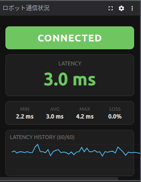

# Ping Monitor Panel - Foxglove Extension

A Foxglove custom panel extension that displays real-time network monitoring data published by the ROS 2 [ping_monitor](https://github.com/NuTech-R/ping_monitor) node.



## Features

- **Connection status** — Color-coded display of CONNECTED / DISCONNECTED / STALE / NO DATA
- **Latency display** — Large RTT value with color based on severity
- **Statistics** — Min / avg / max latency and packet loss rate over the last N samples
- **Sparkline** — SVG chart of latency history (failures shown as red dots)
- **Theme support** — Follows Foxglove light/dark theme

## Monitored Topics

| Topic | Type | Description |
|---|---|---|
| `/ping_latency` | `std_msgs/Float32` | RTT in ms, `-1.0` on failure |
| `/ping_packet_loss` | `std_msgs/Float32` | `0.0` (connected) or `100.0` (disconnected) |

## Installation

```bash
# Install dependencies
npm install

# Install locally into Foxglove desktop (for development)
npm run local-install
```

## Build & Package

```bash
# Development build
npm run build

# Production build & generate .foxe file
npm run package
```

Drag and drop the generated `.foxe` file into Foxglove, or install it from the Extensions screen.

## Panel Settings

Configurable via the gear icon in the panel header:

| Setting | Default | Description |
|---|---|---|
| Latency Topic | `/ping_latency` | Topic publishing RTT values |
| Packet Loss Topic | `/ping_packet_loss` | Topic publishing packet loss values |
| History Size | `60` | Number of samples for statistics and sparkline |
| Stale Timeout (ms) | `3000` | Time without messages before showing STALE status |

## Screenshots

<!-- TODO: Add screenshots here -->

## Development

```bash
npm install
npm run build
```
